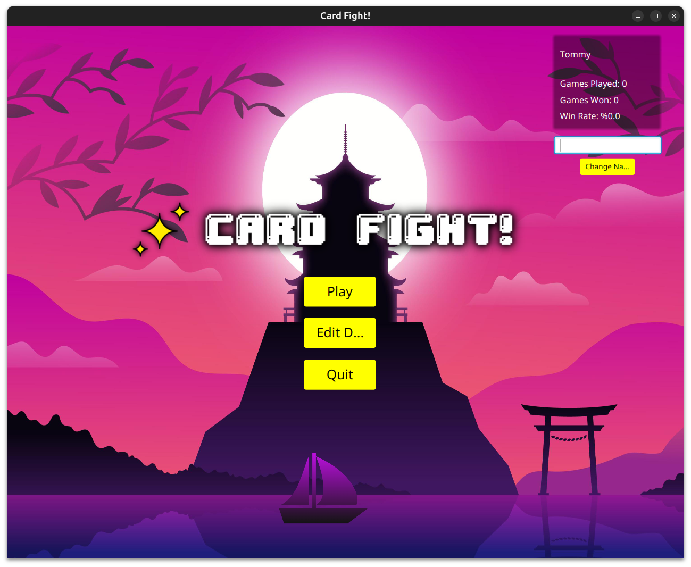
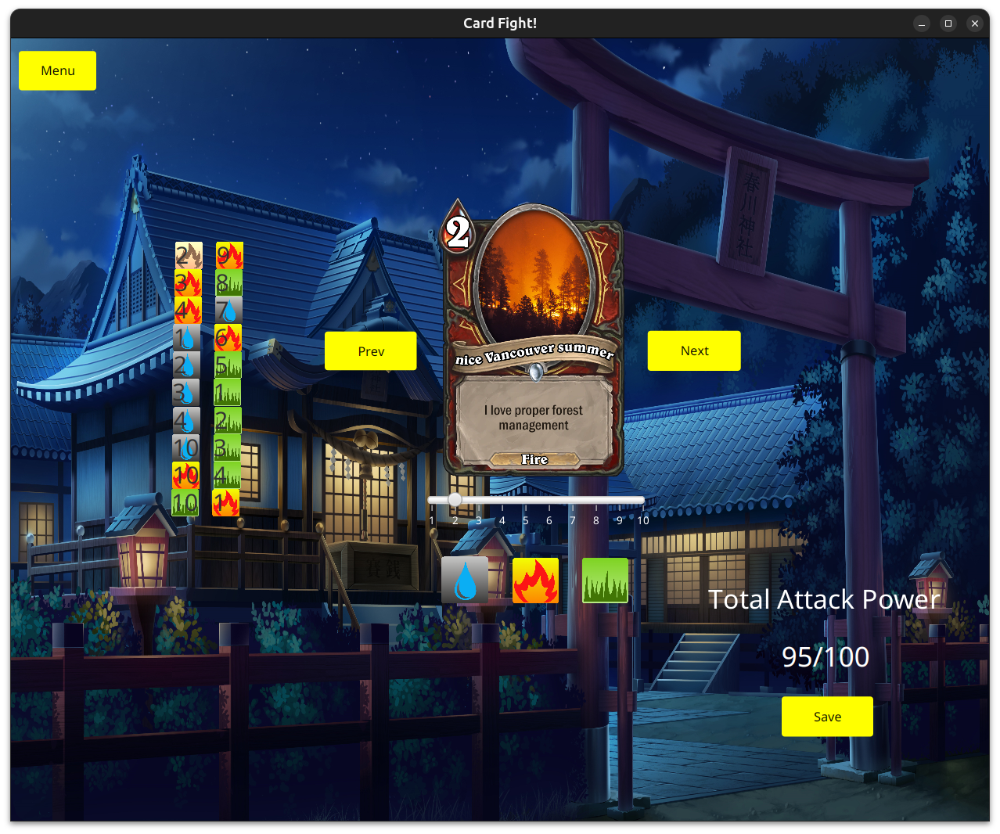
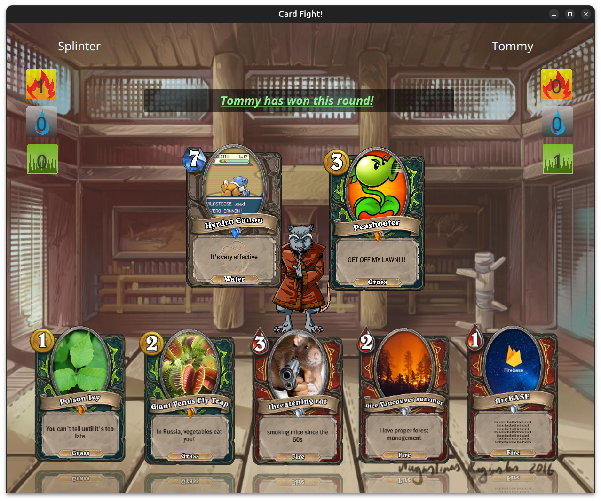
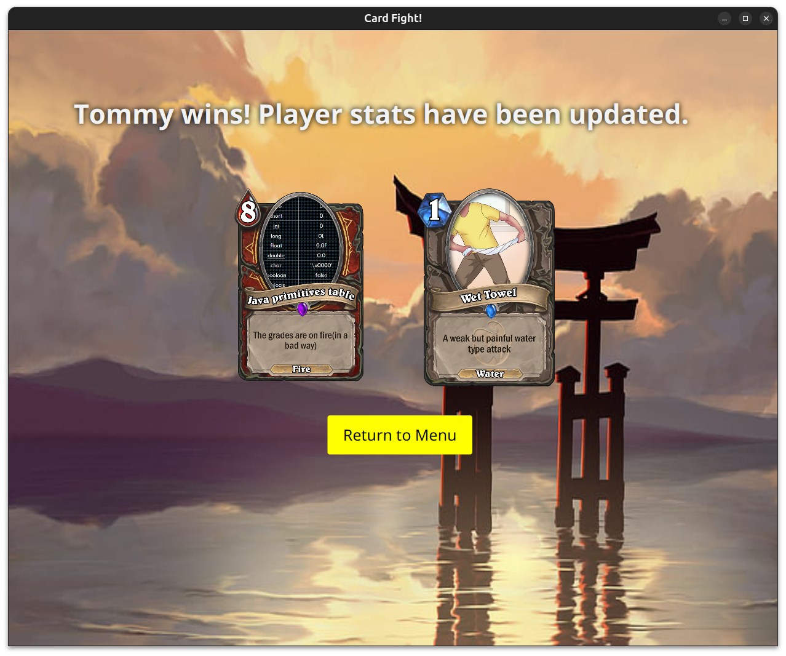

# Card Fight!!!
This game is a card game(duh), but with Rock Paper Scissors style combat. Use the elements to beat Master Splinter in a battle of wits.

# Image Gallery





## Getting Started
When you first launch the game, default player settings are loaded. We suggest changing your name or editing your deck to create 
a personal save. You don't need to, you could hop into a game and challenge splinter first. 
## How to Win
To beat Splinter you will need to play multiple rounds of combat. With each round of combat you will select a card and so will Splinter.
The winner of a combat round is decided either by element or by attack power. To win by element, your card must be of the superior element
(water>grass>fire). To win by attack power, both you and Splinter must have played cards of the same element. Then, your card must have
a higher attack power. 

With each round won, you will harness that element you won with. Upon reaching 3 wins with an element
you claim victory. Or perhaps you are bested by Splinter.
## Editing your Deck
After losing to Splinter you may want to refactor your deck. If you have yet to edit it then you will be using a default deck.
 The default deck is slightly underpowered, and we recommend changing it up. 

Your deck is required to have 20 cards and a max total attack power of 100. How you distribute your cards across the elements is up to you.

To navigating the edit deck screen is easy. Use the previous and next buttons to switch which card in your deck you want to modify.
 Use the slider to change the attack power. Finally, choose the element by clicking on one of the three element icons. To 
save your changes, click on save. You will be returned to the start menu with your deck saved. The save button will only be clickable
if your new deck's total attack power is under 100. If after making changes, you realize you don't like them, just hit the back button
at the top left and your changes will not be saved.

## Serialization implementation
We used serialization to save the player's stats and custom deck. Upon leaving the game screen,
or saving the deck, or changing the player name, the player state is serialized
and put into a new directory called player-save. If player-save does not exist, then it will be created.


## Project Structure
```
├── README.md
├── checkstyle
│   └── COMP-2522-Checkstyle.xml
├── default-save
│   └── default_player.ser
├── documentation
│   ├── Term Project Game Logic.pdf
│   └── comp_2522_mind_map.pdf
├── mvnw
├── mvnw.cmd
├── player-save
│   └── player.ser
├── pom.xml
├── sound-tracks
│   └── background_music.mp3
├── src
│   ├── main
│   │   ├── java
│   │   │   ├── ca
│   │   │   │   └── bcit
│   │   │   │       └── comp2522
│   │   │   │           └── termproject
│   │   │   │               └── cards
│   │   │   │                   ├── AIPlayer.java
│   │   │   │                   ├── Card.java
│   │   │   │                   ├── Deck.java
│   │   │   │                   ├── DeckBuildSceneController.java
│   │   │   │                   ├── Game.java
│   │   │   │                   ├── GameSceneController.java
│   │   │   │                   ├── HelloApplication.java
│   │   │   │                   ├── HelloController.java
│   │   │   │                   ├── HumanPlayer.java
│   │   │   │                   ├── MainApplication.java
│   │   │   │                   ├── Player.java
│   │   │   │                   ├── PlayerWinController.java
│   │   │   │                   └── StartSceneController.java
│   │   │   └── module-info.java
│   │   └── resources
│   │       ├── ca
│   │       │   └── bcit
│   │       │       └── comp2522
│   │       │           └── termproject
│   │       │               └── cards
│   │       │                   ├── DeckBuildScene.fxml
│   │       │                   ├── GameScene.fxml
│   │       │                   ├── StartScene.fxml
│   │       │                   ├── deck_build_scene.css
│   │       │                   ├── game_end_scene.css
│   │       │                   ├── game_scene.css
│   │       │                   ├── hello-view.fxml
│   │       │                   ├── playerWin.fxml
│   │       │                   └── start_scene.css
│   │       ├── card.jpg
│   │       ├── deckbuild_background.jpg
│   │       ├── fire.png
│   │       ├── fire1.png
│   │       ├── fire10.png
│   │       ├── fire2.png
│   │       ├── fire3.png
│   │       ├── fire4.png
│   │       ├── fire5.png
│   │       ├── fire6.png
│   │       ├── fire7.png
│   │       ├── fire8.png
│   │       ├── fire9.png
│   │       ├── game_background.jpg
│   │       ├── game_end_background.jpg
│   │       ├── game_title.png
│   │       ├── grass.png
│   │       ├── grass1.png
│   │       ├── grass10.png
│   │       ├── grass2.png
│   │       ├── grass3.png
│   │       ├── grass4.png
│   │       ├── grass5.png
│   │       ├── grass6.png
│   │       ├── grass7.png
│   │       ├── grass8.png
│   │       ├── grass9.png
│   │       ├── master_splinter.png
│   │       ├── sailboat.png
│   │       ├── start_background.jpg
│   │       ├── test_card.svg
│   │       ├── water.png
│   │       ├── water1.png
│   │       ├── water10.png
│   │       ├── water2.png
│   │       ├── water3.png
│   │       ├── water4.png
│   │       ├── water5.png
│   │       ├── water6.png
│   │       ├── water7.png
│   │       ├── water8.png
│   │       └── water9.png
│   └── test
│       └── java
│           ├── CardTest.java
│           ├── DeckTest.java
│           ├── GameTest.java
│           └── PlayerTest.java
├── target
│   ├── classes
│   │   ├── ca
│   │   │   └── bcit
│   │   │       └── comp2522
│   │   │           └── termproject
│   │   │               └── cards
│   │   │                   ├── AIPlayer.class
│   │   │                   ├── Card.class
│   │   │                   ├── Deck.class
│   │   │                   ├── DeckBuildScene.fxml
│   │   │                   ├── DeckBuildSceneController.class
│   │   │                   ├── Game.class
│   │   │                   ├── GameScene.fxml
│   │   │                   ├── GameSceneController.class
│   │   │                   ├── HelloApplication.class
│   │   │                   ├── HelloController.class
│   │   │                   ├── HumanPlayer.class
│   │   │                   ├── MainApplication.class
│   │   │                   ├── Player.class
│   │   │                   ├── PlayerWinController.class
│   │   │                   ├── StartScene.fxml
│   │   │                   ├── StartSceneController.class
│   │   │                   ├── deck_build_scene.css
│   │   │                   ├── game_end_scene.css
│   │   │                   ├── game_scene.css
│   │   │                   ├── hello-view.fxml
│   │   │                   ├── playerWin.fxml
│   │   │                   └── start_scene.css
│   │   ├── card.jpg
│   │   ├── deckbuild_background.jpg
│   │   ├── fire.png
│   │   ├── fire1.png
│   │   ├── fire10.png
│   │   ├── fire2.png
│   │   ├── fire3.png
│   │   ├── fire4.png
│   │   ├── fire5.png
│   │   ├── fire6.png
│   │   ├── fire7.png
│   │   ├── fire8.png
│   │   ├── fire9.png
│   │   ├── game_background.jpg
│   │   ├── game_end_background.jpg
│   │   ├── game_title.png
│   │   ├── grass.png
│   │   ├── grass1.png
│   │   ├── grass10.png
│   │   ├── grass2.png
│   │   ├── grass3.png
│   │   ├── grass4.png
│   │   ├── grass5.png
│   │   ├── grass6.png
│   │   ├── grass7.png
│   │   ├── grass8.png
│   │   ├── grass9.png
│   │   ├── master_splinter.png
│   │   ├── module-info.class
│   │   ├── sailboat.png
│   │   ├── start_background.jpg
│   │   ├── test_card.svg
│   │   ├── water.png
│   │   ├── water1.png
│   │   ├── water10.png
│   │   ├── water2.png
│   │   ├── water3.png
│   │   ├── water4.png
│   │   ├── water5.png
│   │   ├── water6.png
│   │   ├── water7.png
│   │   ├── water8.png
│   │   └── water9.png
│   ├── generated-sources
│   │   └── annotations
│   ├── generated-test-sources
│   │   └── test-annotations
│   └── test-classes
│       ├── DeckTest.class
│       ├── GameTest$1.class
│       ├── GameTest.class
│       └── PlayerTest.class
└── uml.pdf
```